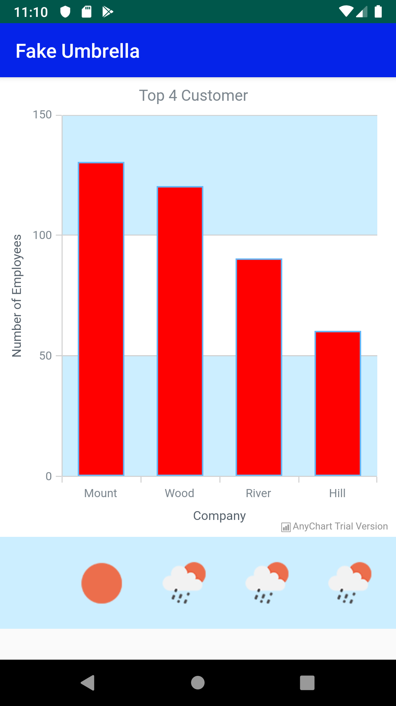

# Fake Umbrella App :umbrella:

Fake Umbrella App allows users to view the current five-day forecast. This data is pulled from OpenWeatherMap.

Users are able to create, update and delete customer information. Users can see Top 4 Customer chart.

# Features
- 5 day forecast
- Top 4customers chart
- works with city name
- keep customer information
- - -

### Title Screen

### Customer List 

### Customer List with 5day forecast

### Top4 Customer chart
- - - 
# Built With
- Retrofit - A type-safe HTTP client for Android and Java
- OpenWeatherMap - Weather API used
- Gson - A Java serialization/deserialization library to convert Java Objects into JSON and back
- Picasso - A powerful image downloading and caching library for Android
- Firebase - RealTime DB
