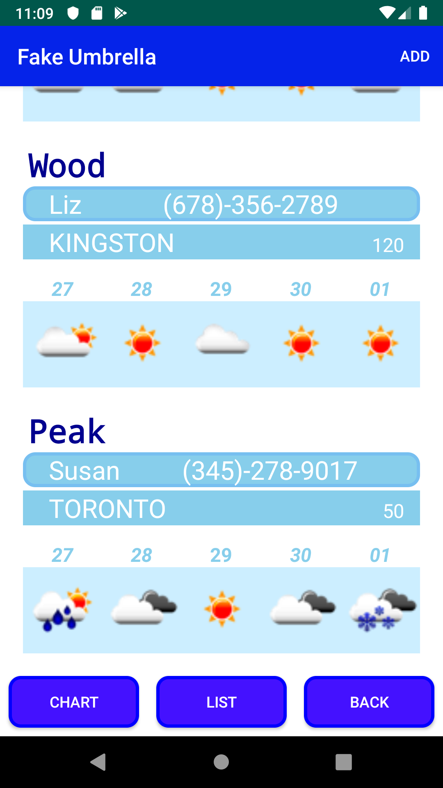

# Fake Umbrella App :umbrella:

Fake Umbrella App allows users to view the current five-day forecast. This data is pulled from OpenWeatherMap.

Users are able to create, update and delete customer information. Users can see Top 4 Customer chart.

# Features
- 5 day forecast
- Top 4 customers chart
- works with city name
- retrieve customer information using RealTime DataBase
- - -
# Instructions
- Click 'ADD' button on upper right corner
- Enter customer name, contact person, phone number, location (city), number of employees
- Long Click on the table list, and 'MODIFY' or 'DELETE' it
- Click 'CHECK CURRENT WEATHER', choose LIST or CHART
- - -
# ScreenShot
  
  

- Title Screen
- Customer List
- Customer List with 5day forecast
- Top4 Customer chart
- - -
  
  

- SignIn Dialog
- Email & Password SignIn
- Google SignIn
- Phone Call
- - - 

# Built With
- Retrofit - A type-safe HTTP client for Android and Java
- OpenWeatherMap - Weather API used
- Gson - A Java serialization/deserialization library to convert Java Objects into JSON and back
- Picasso - A powerful image downloading and caching library for Android
- Lottie - An Animation for title screen
- Firebase - Authentication, RealTime Database used
